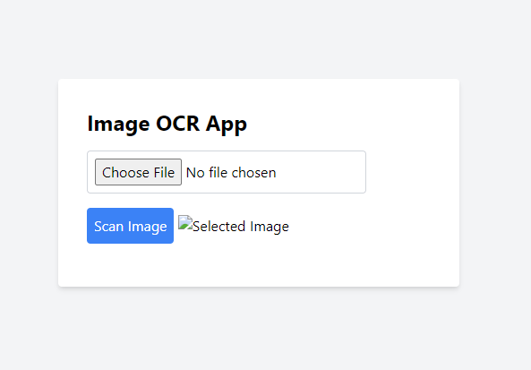
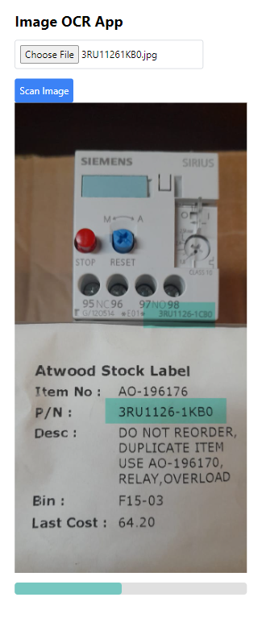
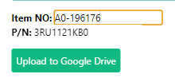

# <span style="color:lightblue">Ener</span><span style="color:lightgreen">Green</span>


---

## inventory control team <span style="color:orange">OCR App</span>
---
### Usage: 
use this app to register faster defected stickers/pn's picture to the drive or other image update purposes.
<br><br><br><br><br><br>

### Steps:
1. Take a medium quality picture **make sure p/n is visible(not blurry)**
2. Upload the picture to the app (**Choose File**)
3. Wait for the app to process the image verify **pn** (you can change the result by clicking and manually fix it)
 - 
4. If the result is correct, click on the **"upload to google drive"** button


## Missing features
- [✔️] **Upload to google drive** button
- [✔️] **Choose File** from personal
- [x] **Upload** button
- [✔️] **OCR** scan image button
- [✔️] **Verify** Humanoid
- [x] **Clear** button
- [x] **Description** button

## Reengeneer WebApp
1. clone repo
2. set up a new AppScript project
3. copy and paste this code in Code.gs
```Js
function doPost(e) {
  try {
    var destination_id = "Folder-Id";
    var destination = DriveApp.getFolderById(destination_id);

    var img = e.parameters.imageFile;
    var fileName = e.parameters.fileName;

    if (img && fileName) {
      var blob = Utilities.newBlob(Utilities.base64Decode(img), MimeType.PNG, fileName);
      destination.createFile(blob);
      return ContentService.createTextOutput("Image uploaded successfully!");
    } else {
      return ContentService.createTextOutput("Error: Image or fileName not provided.");
    }
  } catch (error) {
    return ContentService.createTextOutput("Error uploading file: " + error.message);
  }
}
```
replace **Folder-Id** with your google drive folder id
4. deploy the project
5. update Javascript file **app.js**, -**uploadImageToDrive**- function
```Js
        const serverUrl = 'https://script.google.com/macros/s/your-deployment-key/exec';
```
replace **your-deployment-key** with your deployment key
